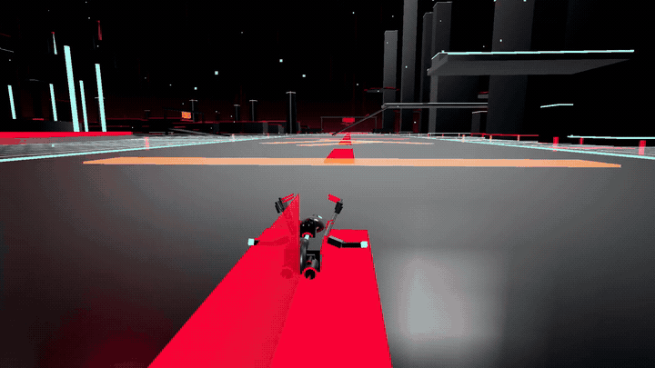

# Grid Protocol

A Three.js grid-combat prototype with transforming vehicles and an Android WebView wrapper.

[](https://mdsadman2004.github.io/#grid-protocol)

*Actual WebGL footage from the local prototype, captured with scripted inputs and a showcase camera. This is a staged in-engine demonstration, not a human playthrough.*

**[Watch driving & flight](https://mdsadman2004.github.io/#grid-protocol)** · **[Driving MP4](docs/showcase/grid-drive.mp4)** · **[Flight MP4](docs/showcase/grid-flight.mp4)**


[Capture notes](docs/showcase/README.md)

## Enter the grid

Grid Protocol combines a procedural arena, transforming vehicles, combat waves, rivals and flight / ground movement. The source includes browser controls, tutorial logic, touch controls and an Android WebView wrapper.

The repository slug is `tron-ares`; the in-project title is **Grid Protocol**. It is a film-inspired prototype, not an official Tron product. Do not infer rights-holder approval from the title or vehicle references.

## Run locally

Use Node.js compatible with the declared Vite 8 dependency:

```bash
git clone https://github.com/MdSadman2004/tron-ares.git
cd tron-ares
npm install
npm run dev
```

Open Vite's printed address. `npm run build` creates `dist/`; `npm run preview` serves the compiled bundle. On Windows, [PLAY.bat](PLAY.bat) is also included.

## Controls

| Input | Action |
| :-- | :-- |
| W / S | Throttle / brake |
| A / D | Steer / bank |
| Up / Down | Climb / dive in flight modes |
| Space / left click | Forward weapon |
| E / right click | Rear weapon |
| Q | Special ability |
| 1–9 / F | Select / cycle configuration |
| Shift | Boost |
| C / H / M / R | Camera / help / mute / grid recall |
| Esc / P | Pause |

See the source for mode-specific behavior. [Campaign](src/campaign.js), [opponents](src/opponents.js), [weapons](src/weapons.js) and [mobile controls](src/mobile.js) are separate modules.

## Android wrapper

[android/app/src/main/java/com/ares/grid/MainActivity.kt](android/app/src/main/java/com/ares/grid/MainActivity.kt) serves the web bundle inside a WebView. Build the web bundle first, then follow the audited [release script](android/tools/release.sh) with a compatible Android SDK / JDK / Gradle setup. Signing material is not supplied and must never be published.

This README does not link an unverified binary-only distribution repository or claim a Play Store release.

## Source guide

| Component | File | Purpose |
| :-- | :-- | :-- |
| Game runtime | [src/main.js](src/main.js) | Input, scenarios and gameplay orchestration |
| Transforming chassis | [src/chassis.js](src/chassis.js) | Articulated vehicle configurations |
| Procedural grid | [src/world.js](src/world.js) | World geometry and environment construction |

## Scope & limitations

This presentation update does not re-test gameplay, Android packaging or frame rate. The source includes an attract-mode demonstration and touch autopilot; inspect their defaults before assuming every launch is manual. Film-inspired names and visual motifs remain in the source; an affiliation disclaimer does not establish legal clearance. The existing hero.png is a framework-style graphic, not gameplay, and is intentionally not used as a preview.

## Reuse & attribution

No standalone repository-wide license file is included in this checkout. Public source access is not a blanket license grant; check provenance and permissions before redistribution.
